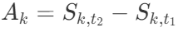

以下是以 Markdown 代码形式呈现的混淆矩阵相关内容，已用 $$ 包裹公式：
1. 混淆矩阵：
    - 假设存在$n$种土地利用一级类型，混淆矩阵记为$C$，是一个$n×n$的方阵，其中元素$c_{ij}$表示实际为第$i$类土地，却被分类成第$j$类土地的像元数量（或样本数量）。
    - 例如对于耕地、林地、建设用地$3$种一级类型（$n = 3$）：
$$
C = 
\begin{pmatrix}
c_{11} & c_{12} & c_{13} \\
c_{21} & c_{22} & c_{23} \\
c_{31} & c_{32} & c_{33}
\end{pmatrix}
$$
这里，$c_{11}$为实际是耕地且被正确分类为耕地的像元数，$c_{12} $是实际为耕地但被误分类为林地的像元数，依此类推。变量含义：$n$代表土地利用一级类型的总数，$c_{ij}$中的$i$指代实际的土地类型序号，$d$指代被分类成的土地类型序号，通过$c_{ij}$的值可直观了解不同类型土地在分类过程中的错分、正确分类情况。

1. **转移矩阵的用处**：
    - 其一，能精准呈现土地利用类型的动态转换情况。通过矩阵元素明确各类型土地在一定时段内的流向与规模，如在长顺县研究中，可知耕地转建设用地的面积，助力剖析土地利用变化过程。以一个具体的土地利用转移矩阵为例，若研究区域存在耕地、林地、建设用地三种土地利用类型，对应的转移矩阵$T$为：
\[
T = 
\begin{pmatrix}
t_{11} & t_{12} & t_{13} \\
t_{21} & t_{22} & t_{23} \\
t_{31} & t_{32} & t_{33}
\end{pmatrix}
\]
其中$t_{13}$明确表示了从耕地转变为建设用地的面积数值，让土地利用变化一目了然。
    - 其二，辅助深入探究土地利用变化规律。借助行和、列和等特征，掌握不同土地类型初始总量与新增来源，为规划土地资源、揭示变化驱动因素提供关键依据。例如，通过计算矩阵某一行的行和，就能知道该类土地的初始规模，即对于某一土地类型$i$，其行和$\sum_{j = 1}^{m} t_{ij}$代表该类型初始总面积；查看某一列的列和，可明确转变为这类土地的总面积，也就是对于目标土地类型$j$，列和$\sum_{i = 1}^{m} t_{ij}$表示转变为该类型的总面积，进而深入分析土地利用的演变逻辑。

2. **变量含义**：
    - 设研究区域有$m$种土地利用类型，记土地利用转移矩阵为$T$，它是$m×m$方阵，其中$t_{ij}$（$i$指代起始土地利用类型序号，$j$指代转变后类型序号），如$t_{12}$表示从耕地转林地的面积。这里的矩阵$T$就是对研究区域土地利用转换情况的量化呈现，每一个元素$t_{ij}$都承载着特定土地类型转换的信息。
    - 对于行和$\sum_{j = 1}^{m} t_{ij}$（$i$为某一土地类型），它代表该类型初始总面积；列和$\sum_{i = 1}^{m} t_{ij}$（$j$为目标土地类型），它表示转变为该类型的总面积。比如在上述三种土地利用类型的例子中，第一行的行和$\sum_{j = 1}^{3} t_{1j}$就是耕地的初始总面积，第三列的列和$\sum_{i = 1}^{3} t_{i3}$则是转变为建设用地的总面积，这些数据对于理解土地利用动态变化至关重要。

# n 阶转移矩阵
$$
T = 
\begin{pmatrix}
t_{11} & t_{12} & \cdots & t_{1n} \\
t_{21} & t_{22} & \cdots & t_{2n} \\
\vdots & \vdots & \ddots & \vdots \\
t_{n1} & t_{n2} & \cdots & t_{nn}
\end{pmatrix}

$$

# n 阶混淆矩阵
$$
C = 
\begin{pmatrix}
c_{11} & c_{12} & \cdots & c_{1n} \\
c_{21} & c_{22} & \cdots & c_{2n} \\
\vdots & \vdots & \ddots & \vdots \\
c_{n1} & c_{n2} & \cdots & c_{nn}
\end{pmatrix}
$$

$A_k = \frac{S_{k, t_2} - S_{k, t_1}}{S_{k, t_1}}$